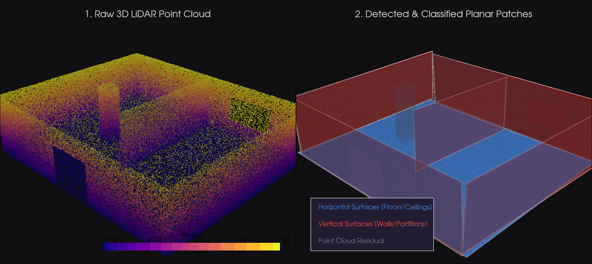

# 🏗️ PC_plane_detector - 3D Architectural Plane Detector

[](https://www.python.org/)
[](http://www.open3d.org/)
[](https://pyvista.org/)
[](LICENSE)
[]()

> **Automated 3D architectural and structural plane extraction, topological trimming, and semantic classification from LiDAR and photogrammetry point clouds (`.las`, `.laz`, `.ply`, `.pcd`).**
>
> *Strumento da riga di comando per reverse engineering e analisi spaziale: segmenta ed estrae automaticamente pavimenti, solai e pareti verticali da nuvole di punti dense, separando con precisione le superfici piane dagli involucri curvi ed esportando modelli CAD (DXF) e report semantici JSON.*

---

## 📸 Anteprima Pipeline (3D Preview)



*A sinistra: Nuvola di punti LiDAR 3D originale (con mappa altimetrica). A destra: Piani geometrici estratti e classificati automaticamente (Blu = Orizzontali/Pavimenti, Rosso = Verticali/Pareti).*

---

## ✨ Caratteristiche Principali

- 🌐 **Supporto Multiformato Nativo:** Caricamento ottimizzato di file compressi `.las`, `.laz` (tramite `laspy`), `.ply`, `.pcd` e `.xyz`.
- 🔄 **Pipeline Iterativa a Due Passaggi:** Risolve il classico trade-off di segmentazione, combinando parametri permissivi per i grandi solai e vincoli rigidi anti-curvatura per le pareti.
- ✂️ **Trimming Topologico & Classificazione Semantica:** Rilevamento delle intersezioni tra piani contigui, rifilatura delle sporgenze e attribuzione semantica automatica (*Floor, Ceiling, Wall, Oblique*).
- 📐 **Export CAD & Reverse Engineering:** Generazione diretta di facce 3D esportate in file `.dxf` organizzati per layer semantici e report analitici in `.json`.
- 🖥️ **Visualizzazione Interattiva 3D:** Ispezione visiva intuitiva con codifica a colori, mesh wireframe e supporto PyVista / Open3D.

---

## 📦 Installazione

Si consiglia l'uso di un ambiente virtuale (es. `conda` o `venv` con Python >= 3.10):

```bash
# Clona il repository
git clone https://github.com/ndree97/PC_plane_detector.git
cd PC_plane_detector

# Installa le dipendenze
pip install -r requirements.txt
```

---

## 🚀 Guida Rapida all'Uso

### 1. Pipeline Avanzata con Trimming e Export CAD (Consigliata)
Esegue l'estrazione semantica completa a due passaggi, calcola le intersezioni e genera l'export DXF:

```bash
python detect_planes.py sample_pointcloud.las --planes-only --hide-oblique
```

### 2. Estrazione Rapida Interattiva
Visualizzazione rapida delle patch planari estratte tramite RANSAC + Region Growing:

```bash
python main.py sample_pointcloud.las --knn 30 --variance 25.0 --coplanarity 45.0 --planes-only
```

---

## 🛠️ Guida ai Parametri CLI

L'algoritmo adatta l'estrazione alla conformazione geometrica e al livello di rumore della scansione:

| Parametro | Descrizione Geometrica | Impatto Visivo |
| :--- | :--- | :--- |
| `--knn` | Numero di vicini per il calcolo delle normali e clustering k-d tree. | **Basso**: cattura dettagli fini ma è vulnerabile al rumore.<br>**Alto**: leviga le superfici, ideale per materiali riflettenti. |
| `--variance` | Varianza normale massima (in gradi). Tolleranza di divergenza tra le normali. | **Basso**: ammette solo superfici perfettamente complanari.<br>**Alto**: accetta superfici rugose o con lieve curvatura. |
| `--coplanarity` | Tolleranza di complanarità (in gradi). Definisce lo "spessore" accettato per un piano. | **Basso**: piani sottili e rigorosi.<br>**Alto**: assorbe il rumore di profondità (tubature, quadri, canaline). |
| `--outlier` | Percentuale massima di outlier accettata nel volume di delimitazione del piano. | **0.5**: rigoroso.<br>**0.85-0.90**: tollera molti ostacoli a contatto con il piano. |
| `--min-edge` | Lunghezza minima del lato più corto del piano (in metri o unità scena). | **0.0**: disattivato (estrae qualsiasi frammento).<br>**1.0**: ignora muri o frammenti larghi meno di 1 metro. |
| `--min-points` | Numero minimo di punti richiesti per validare un piano. | **0**: disattivato.<br>**1000**: ignora superfici poco campionate. |
| `--planes-only`| **(Flag)** Nasconde la nuvola di punti e mostra solo le mesh dei piani estratti. | Visione pulita del modello geometrico. |

---

## 📐 Strategie per Ambienti Complessi (Architettonici, Industriali, Navali)

Nelle scansioni complesse, i pavimenti (ampi e continui) vengono individuati facilmente, mentre le pareti verticali rischiano di frammentarsi a causa di porte, tubazioni o curvature contigue.

### 🎯 3 Configurazioni Sequenziali per Pareti Verticali

#### 1. Modalità ad Alta Tolleranza (Bassa soglia dimensionale)
Cattura pareti corte, partizioni interne e tramezzi, assorbendo elementi superficiali a parete:
```bash
python main.py sample_pointcloud.las --knn 50 --variance 45.0 --coplanarity 80.0 --outlier 0.90 --min-edge 0.0 --min-points 50 --planes-only
```

#### 2. Modalità "Pareti Rigide" (Blocco scivolamento su superfici curve)
Da utilizzare quando la scansione include involucri curvi (volte, cupole, tubazioni di grande diametro, scafi) per arrestare il piano al punto di tangenza:
```bash
python main.py sample_pointcloud.las --knn 30 --variance 15.0 --coplanarity 70.0 --outlier 0.85 --min-edge 0.5 --min-points 100 --planes-only
```

#### 3. Modalità "Scansione Diradata" (Punti radi o pareti distanti)
Da utilizzare quando la densità di punti sulle pareti lontane dalla stazione di scansione è bassa:
```bash
python main.py sample_pointcloud.las --knn 80 --variance 50.0 --coplanarity 85.0 --outlier 0.80 --min-edge 0.0 --min-points 10 --planes-only
```

---

## 🔧 Risoluzione dei Problemi Frequenti

* **Pavimento rilevato, ma mancano i muri?** ➔ Imposta `--min-edge 0.0` e aumenta `--coplanarity` a `80.0`.
* **Troppi piccoli piani spuri a mezz'aria?** ➔ Aumenta `--min-edge` a `1.0` o `--min-points` a `500`.
* **Superfici curve classificate erroneamente come pareti?** ➔ Abbassa `--variance` (es. `10.0` - `15.0`).
* **Troppi frammenti obliqui (grigi)?** ➔ La nuvola potrebbe non essere allineata all'asse Z globale (scanner non perfettamente in bolla). Verifica l'orientamento globale prima dell'elaborazione.

---

## 📄 Licenza

Questo progetto è rilasciato sotto licenza [MIT](LICENSE).